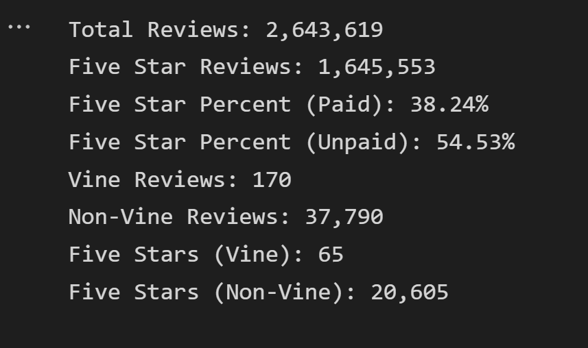

# Amazon_Vine_Analysis

## Note

My AWS database password is visible in the PySpark notebook but I have already deleted the database instance.

## Overview

The purpose of this analysis is to examine Amazon product review data to determine which reviews are more helpful or reflective of a user's true opinion of a product.

## Results

- There are a total of 2,643,619 reviews. For the analysis, I generally restricted reviews to higher-engagement reviews with at least 20 votes.
- In the high-engagement subset, there are 170 Vine reviews and 37,790 non-Vine reviews
- For high-engagement reviews, 65 Vine reviews are five stars while 20,605 non-Vine reviews are five stars.
- By percentages, about 38.24% of Vine reviews are five stars while about 54.53% of non-Vine reviews are five stars.

## Summary

There does not seem to be a positivity bias for reviews in the Vine program because a higher percentage of non-Vine reviews are five stars. However, a limitation of the data is that there are much fewer Vine reviews in the high-engagement data than non-Vine reviews. An alternative analysis to assess positivity bias would be to run the same analysis on the following subsets rather than high-engagement:

- High-engagement reviews with a high ratio of helpful votes to total votes, for popular reviews.
- High-engagemeny reviews with a low ratio of helpful votes to total votes, for controversial reviews.

## Data Source

I used the following data source: [https://s3.amazonaws.com/amazon-reviews-pds/tsv/amazon_reviews_us_Pet_Products_v1_00.tsv.gz](https://s3.amazonaws.com/amazon-reviews-pds/tsv/amazon_reviews_us_Pet_Products_v1_00.tsv.gz).

